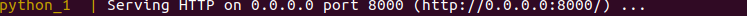

# wasm_presentation
This is a demo of wasmer-php, wasmer-python and wasm-bindgen. We also demonstrate how a wasm module may be loaded by javascript. The purpose of this repository is only to demonstrate webassembly (interacting wiht php, python and js).

## Setup 
```
docker-compose build
```
This builds the Rust, Python and PHP containers. 

## Usage 
run 
```
docker-compose up
```
and wait for the Rust container to finish its work and exit.  Once this is done the wasm binaries will be available in the `wasm_binaries` directory. 

The php container contains a few examples: To run them first get a shell by running
```
docker-compose exec php bash
```
then one may for instance try the script calling the compiled recursive fibonacci function by running 
```
php -f fib_recursive_wasm.php
```

The python container contains a script where we send a greetings between the host (python) and the guest (rust). To run this first get a shell to the container: 
```
docker-compose exec python bash
```

```
python3 greet.py
```


The javascript examples may be viewed in the browser by clicking on the link displayed in the terminal after running docker-compose up: 

